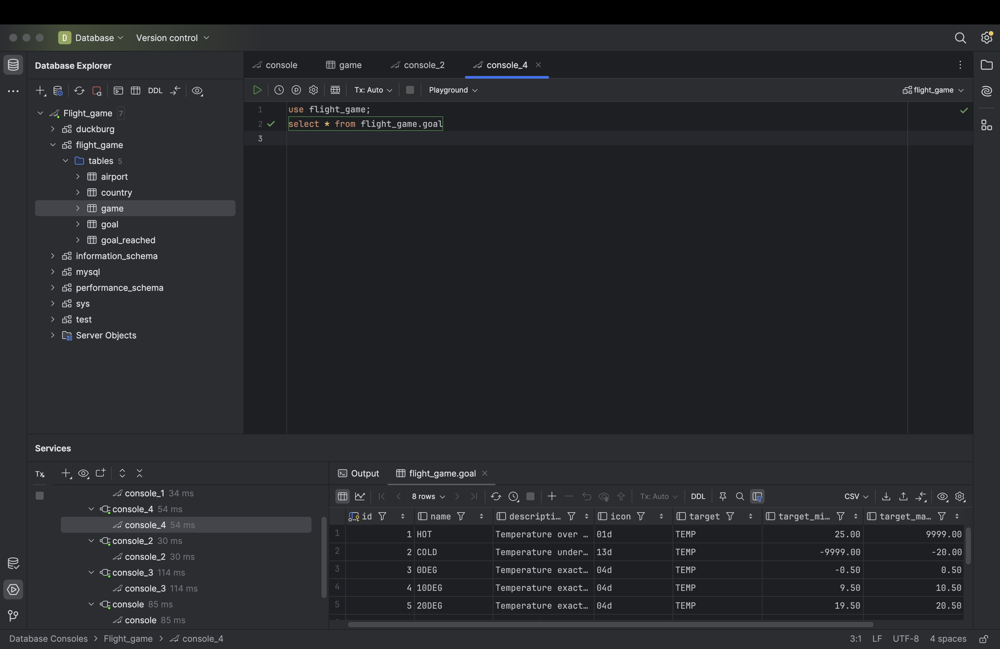
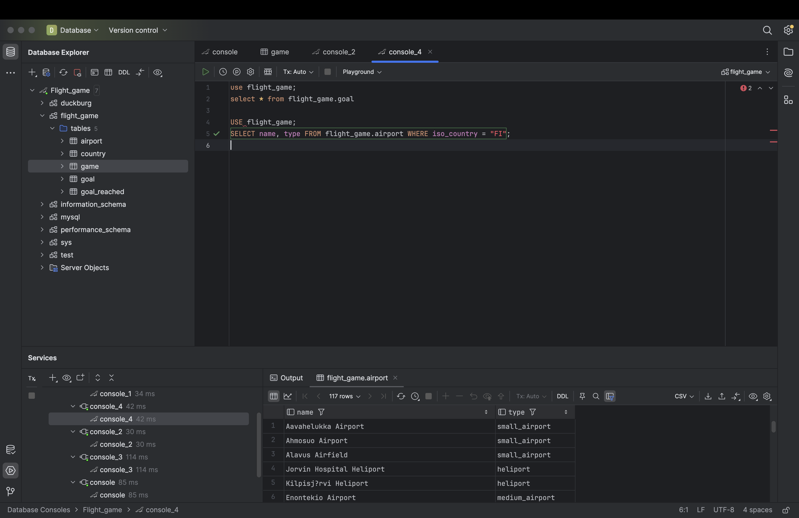
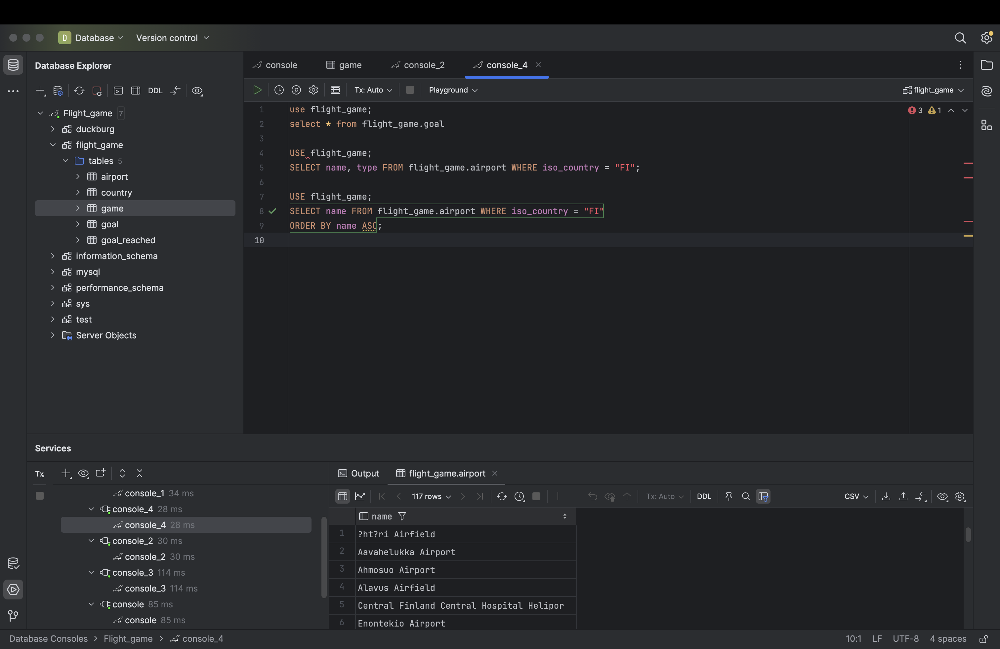
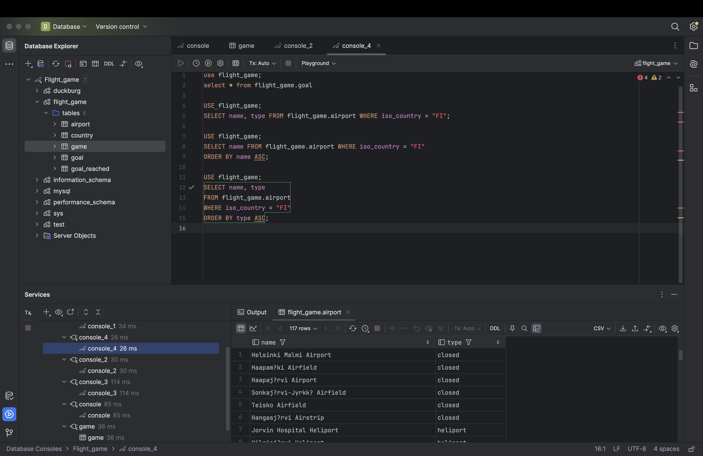
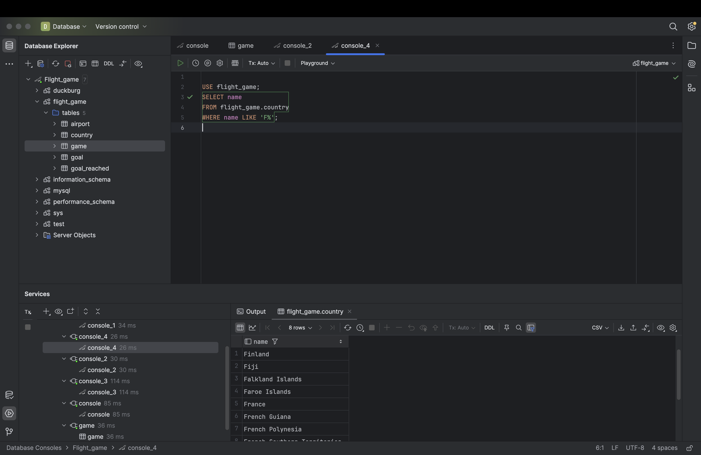
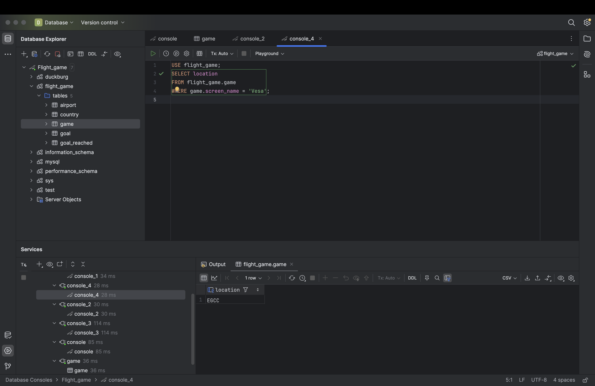
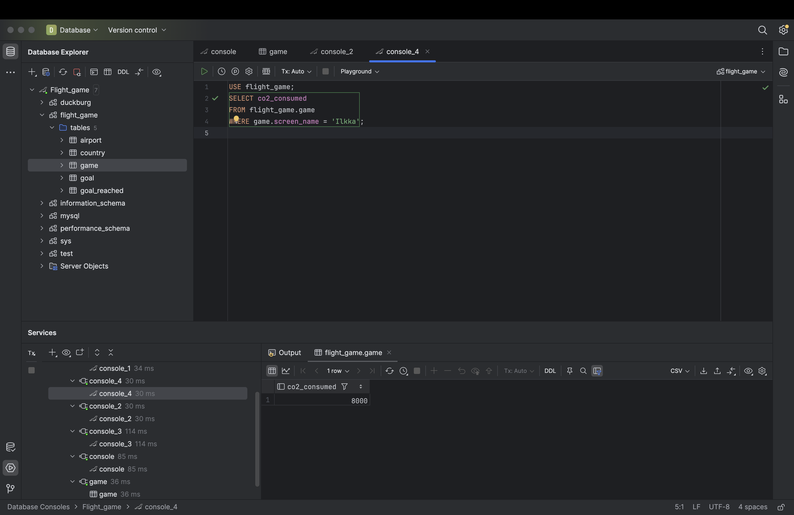
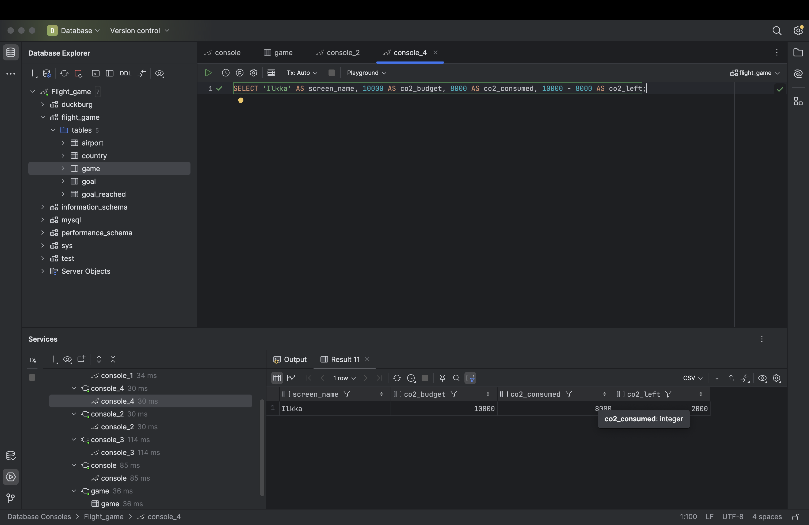

# Week 3

## Exercise 2: single table Queries

### 1
use flight_game;
select * from flight_game.goal

### 2
USE flight_game;
SELECT name, type FROM flight_game.airport WHERE iso_country = "FI";

### 3
USE flight_game;
SELECT name FROM flight_game.airport WHERE iso_country = "FI"
ORDER BY name ASC;

### 4
USE flight_game;
SELECT name, type
FROM flight_game.airport
WHERE iso_country = "FI"
ORDER BY type ASC;

### 5
USE flight_game;
SELECT name
FROM flight_game.country
WHERE name LIKE 'F%';

### 6
USE flight_game;
SELECT name 
FROM flight_game.country 
WHERE name LIKE '%F%' 
ORDER BY name ASC;

### 7
USE flight_game;
SELECT location 
FROM flight_game.game
WHERE game.screen_name = 'Vesa';

### 8
USE flight_game;
SELECT co2_consumed
FROM flight_game.game
WHERE game.screen_name = 'Ilkka';

### 9
USE flight_game;
SELECT co2_budget
FROM flight_game.game
WHERE game.screen_name = 'Ilkka';

### 10
SELECT 'Ilkka' AS screen_name, 10000 AS co2_budget, 8000 AS co2_consumed, 10000 - 8000 AS co2_left;

