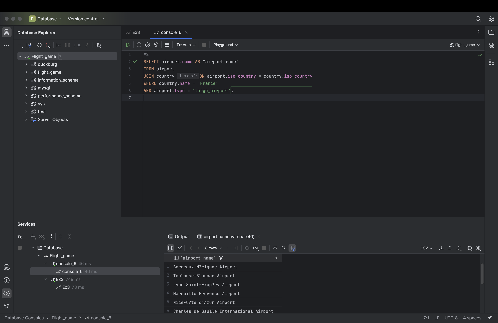

# Week 3

## Exercise 3: Multiple Table Queries

### 1
USE flight_game;
SELECT country.name AS "country name", airport.name AS "airport name"
FROM country
JOIN airport ON airport.iso_country = country.iso_country
WHERE country.name = 'Iceland';

### 2
SELECT airport.name AS "airport name"
FROM airport
JOIN country ON airport.iso_country = country.iso_country
WHERE country.name = 'France'
AND airport.type = 'large_airport';

### 3
SELECT country.name AS country_name, airport.name AS airport_name
FROM country
JOIN airport ON airport.iso_country = country.iso_country
WHERE country.continent = 'AN';

### 4
SELECT airport.elevation_ft
FROM game
JOIN airport ON game.location = airport.ident
WHERE game.screen_name = 'Heini';

### 5
SELECT airport.elevation_ft * 0.3048 AS elevation_m
FROM game
JOIN airport ON game.location = airport.ident
WHERE game.screen_name = 'Heini';

### 6
SELECT airport.name
FROM game
JOIN airport ON game.location = airport.ident
WHERE game.screen_name = 'Ilkka';

### 7
SELECT country.name
FROM game
JOIN airport ON game.location = airport.ident
JOIN country ON airport.iso_country = country.iso_country
WHERE game.screen_name = 'Ilkka';

### 8
SELECT goal.name
FROM game
JOIN goal_reached ON game.id = goal_reached.game_id
JOIN goal ON goal_reached.goal_id = goal.id
WHERE game.screen_name = 'Heini';

### 9
SELECT airport.name
FROM game
JOIN goal_reached ON game.id = goal_reached.game_id
JOIN goal ON goal_reached.goal_id = goal.id
JOIN airport ON game.location = airport.ident
WHERE game.screen_name = 'Ilkka'
AND goal.name = 'CLOUDS';

### 10
SELECT country.name
FROM game
JOIN goal_reached ON game.id = goal_reached.game_id
JOIN goal ON goal_reached.goal_id = goal.id
JOIN airport ON game.location = airport.ident
JOIN country ON airport.iso_country = country.iso_country
WHERE game.screen_name = 'Ilkka'
AND goal.name = 'CLOUDS';

