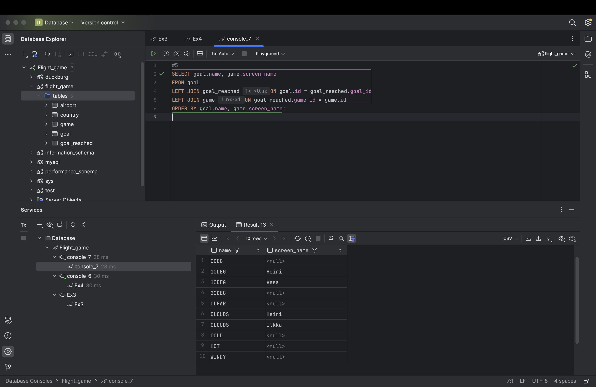

# Week 4

## Exercise 4: Join

### 1
USE flight_game;
SELECT country.name AS "country name", airport.name AS "airport name"
FROM country
JOIN airport ON airport.iso_country = country.iso_country
WHERE country.name = 'Finland'
AND airport.scheduled_service = 'yes';

### 2
SELECT game.screen_name, airport.name
FROM game
JOIN airport ON game.location = airport.ident;

### 3
SELECT game.screen_name, country.name
FROM game
JOIN airport ON game.location = airport.ident
JOIN country ON airport.iso_country = country.iso_country;

### 4
SELECT airport.name, game.screen_name
FROM airport
LEFT JOIN game ON airport.ident = game.location
WHERE airport.name LIKE '%Hels%'
ORDER BY game.screen_name IS NULL, game.screen_name;

### 5
SELECT goal.name, game.screen_name
FROM goal
LEFT JOIN goal_reached ON goal.id = goal_reached.goal_id
LEFT JOIN game ON goal_reached.game_id = game.id
ORDER BY goal.name, game.screen_name;

