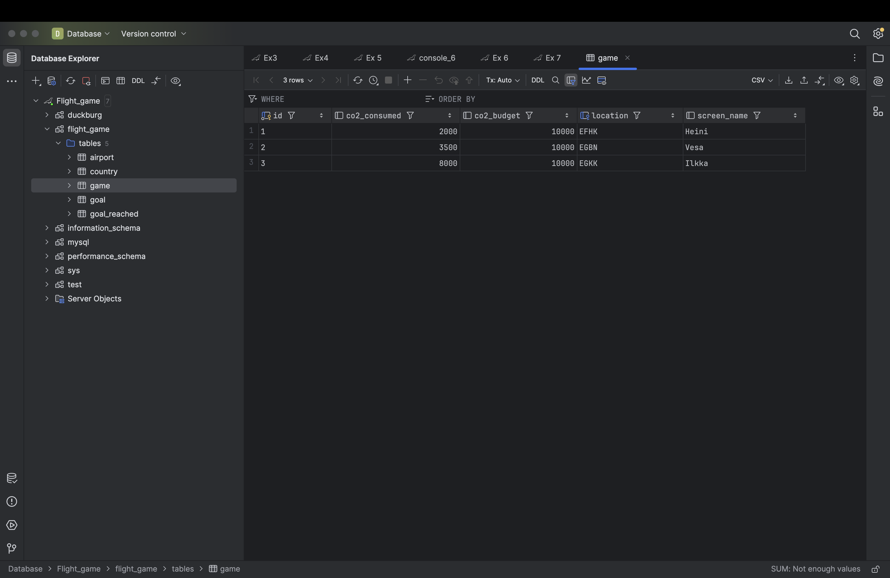

# Week 5

## Exercise 7: Update Queries

### 1
UPDATE game
SET co2_consumed = co2_consumed + 500,
    location = (SELECT ident FROM airport WHERE name = 'Nottingham Airport')
WHERE screen_name = 'Vesa';
 

### 2
b. goal_reached

### 3
DELETE FROM goal_reached;

### 4
DELETE FROM game;
